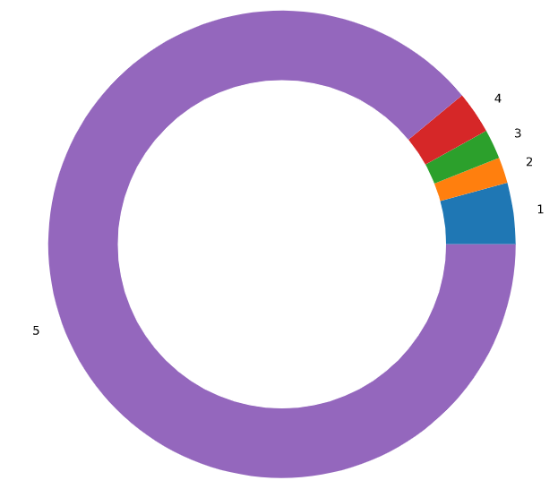
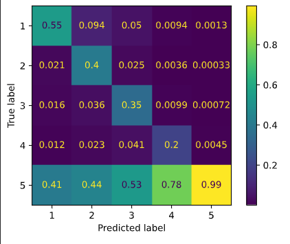
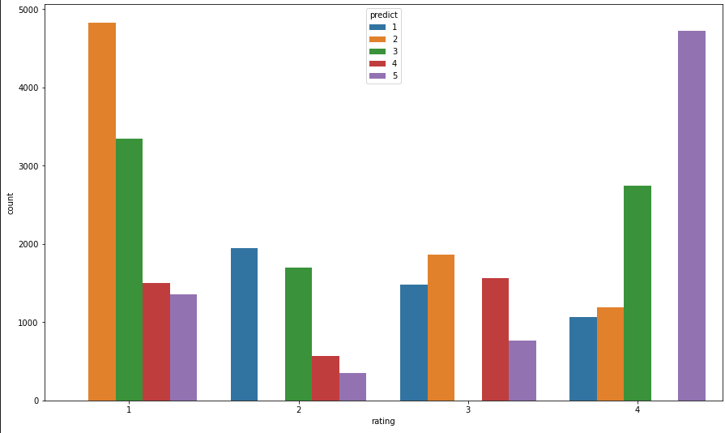
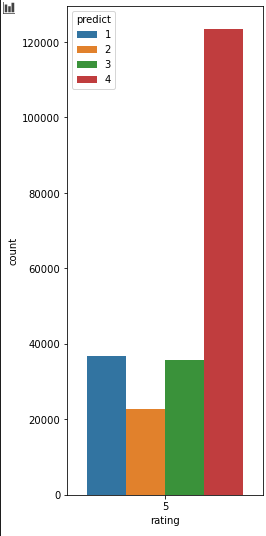
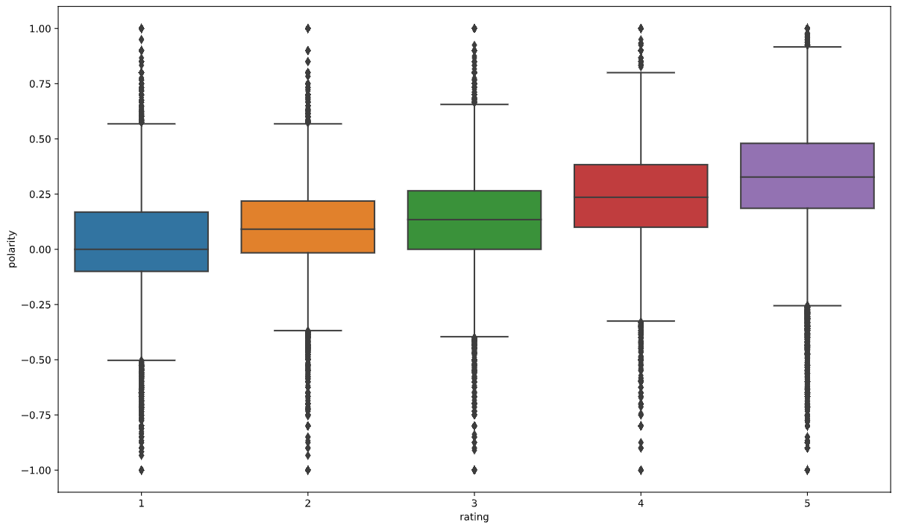
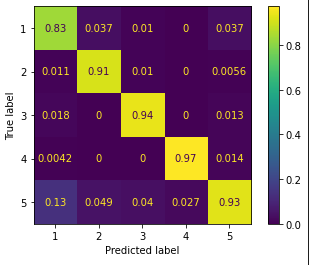
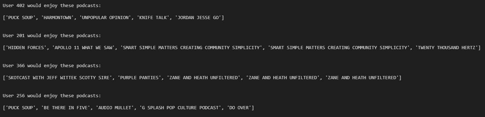
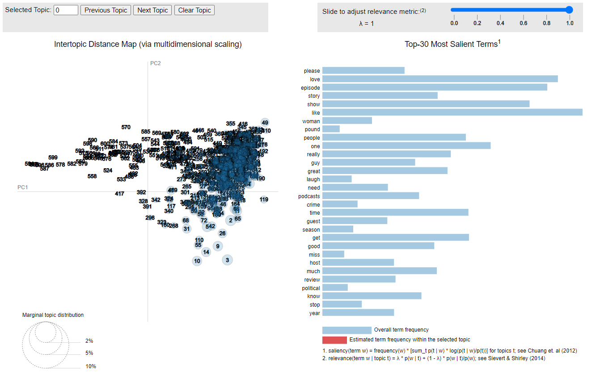

# Predicting and Recommending Your Next Podcast Obsession
Note: the podcast dataset is too large to be included in this GitHub repository. It is updated monthly and can be found at https://www.kaggle.com/thoughtvector/podcastreviews

### Project Goal: 
Use the podcast dataset to test a variety of models, supervised and unsupervised, with two subgoals: To use NLP analysis from written podcast reviews to predict numerical reviews left by consumers, and to build a recommender system for users to discover new podcasts they may like.

### First Step: 
# Exploratory Data Analysis

The first steps are universal data cleaning processes. I checked the 1,425,165 points of data and found no missing values but eliminated 642 duplicates. Each data point contains a podcast name, a user's written review and a user's numerical review. Checking the numerical rating, I find it to be a 1-5 scale and hugely imbalanced in favor of the 5.

### Second Step:
# NLP and First Predictive Model

I tokenize, remove stop words, lemmatize and incorporate the texts of the documents into a corpus and apply TF-IDF Vectorization. Now the text data is in a sparse matrix and ready to be analyzed by a model. I use a Logistic Regression model to output predictions on the dataset. Below is the applicable confusion matrix.

The confusion matrix is interesting. The worst performing rating is 4. Not surprising, as rating a product a 4 is close to a 5 rating in a practical sense, and with a dataset so strongly imbalanced toward a 5 it makes sense to predict a 5 when it is close. In fact, the whole model is generally either predicting class 5 or a higher class than actual. Considering the imbalanced dataset, this makes sense. If you consider ratings that were misclassified within a margin of error of 1, the confusion matrix is showing at worst a 60% success rate per rating and 70% for the next score. I'm satisfied with these results.

Here I've plotted each rating by counts of its incorrectly predicted ratings. It is clear that a huge number of misclassifications are within 1 point. In fact, when I calculate the overall average error of predicted vs actual ratings, the average error is 1.57. This is a good result, but one that could be improved.

Next I use TextBlob to analyze the sentiment polarity of the written reviews. As written product reviews should strongly correlate with the positivity or negativity of the score, I expect TextBlob's analysis to trend upward with the ratings.

TextBlob trends upward with ratings as expected. A high number of outliers are also unsurprising given the size of the dataset. Seeing both extremes of polarity represented on every rating is a little surprising. It suggests two things: 1. Our NLP methods may be having a hard time interpreting some entries, like the difference between 'good' and 'not good.' 2. Some user error may be involved, with poor written reviews being matched with high numerical reviews. In both cases, further insight into the data may yield positive results.

The Interquartile range, or middle 50%, of each rating is roughly the same size with rating '2' being a little smaller than the rest. This indicates a consistent distribution across each rating.

What is striking is how slight the raise is between neighboring ratings. This reflects the real world in which an opinion of an item being a 3 vs a 4 is pretty narrow. The wider the gap between ratings, the larger the gap in polarity, as would be expected in a real world situation.

### Third Step:
# Fit an Improved Model on a New Dataset

For our next step, it's time to shrink the dataset. First I eliminate all the data points that were accurately predicted. Then, considering our average misclassification is 1.57 plus our earlier discussion on how insignificant a single point of misclassification is, we eliminate all data points that were predicted within 1 rating point. With our new standards for acceptable error, our data set is down to approximately 107,000 entries. That's 7.5% of our original set.

Now we train test split and test two models. First, our original Logistic Regression model. It performs extremely poorly. This is to be expected, as this dataset is comprised entirely of data points that model failed to predict. Next, we try a Random Forest model. It performs extremely well.

I am very happy with the performance of the Random Forest model. The weakest predicted rating is 1 and I have two possible explanations. First, the NLP process may have difficulty differentiating English construction. 'Good' and 'not good' may be confusing to the model. Further steps such as incorporating n-grams could be taken to address this. Second, user error could be strong with the 1 rating. A user could write a positive review and leave a 1 by accident, thinking the scale is reversed. Looking at the 5 rating, predicting a 1 is the most common misclassification. At the least, this suggests a correlation between the predictions of the extreme ends of the ratings.

### Fourth Step:
# Build a Recommender System Using K Means Clustering

The surprise library is a well regarded system to build a user based recommender system. It requires three inputs: User IDs, Item IDs, and ratings. The dataset does not include User IDs. I could create a content base recommender system with the data, but where's the fun in that? Instead, let's use K Means clustering. The idea is to use the processed text information I've created and use that to simulate User IDs based on writing styles. I decided to create 500 clusters to simulate 500 users leaving about 200 reviews on average. Might not be incredibly realistic, but as an exercise in clustering, it is enough for a creative solution. I take the predicted clusters and create user data, which I put into the surprise library. What I've created is now an effective user based recommender system. It

It's difficult to effectively visualize such a high number of clusters but LDA lends itself well to visualizing clusters of text data. LDA is unsupervised learning that divides a corpus into topics using the supplied documents by mathematically looking for related terms. LDA is also interactive and an incredibly helpful tool for exploring your text data. This picture, however, is not interactive.

